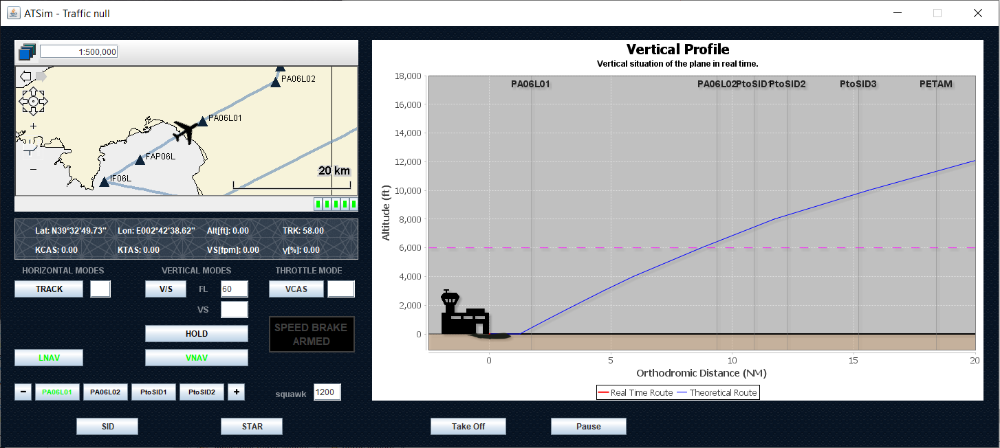
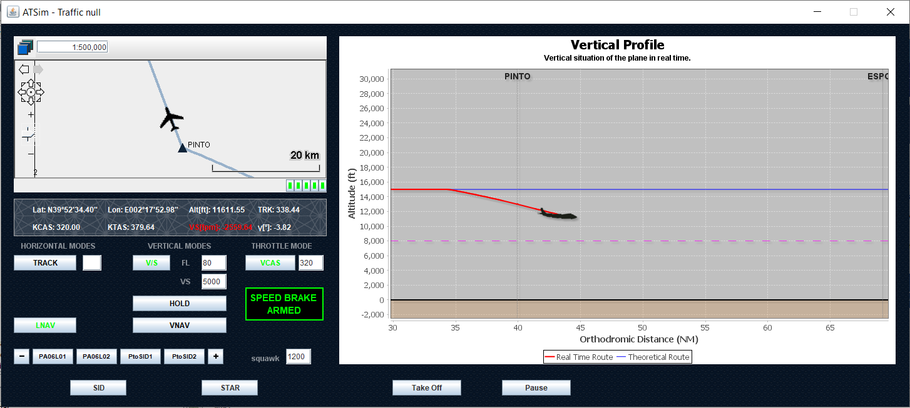
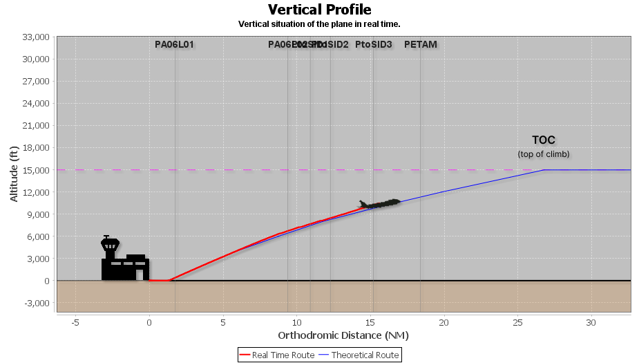
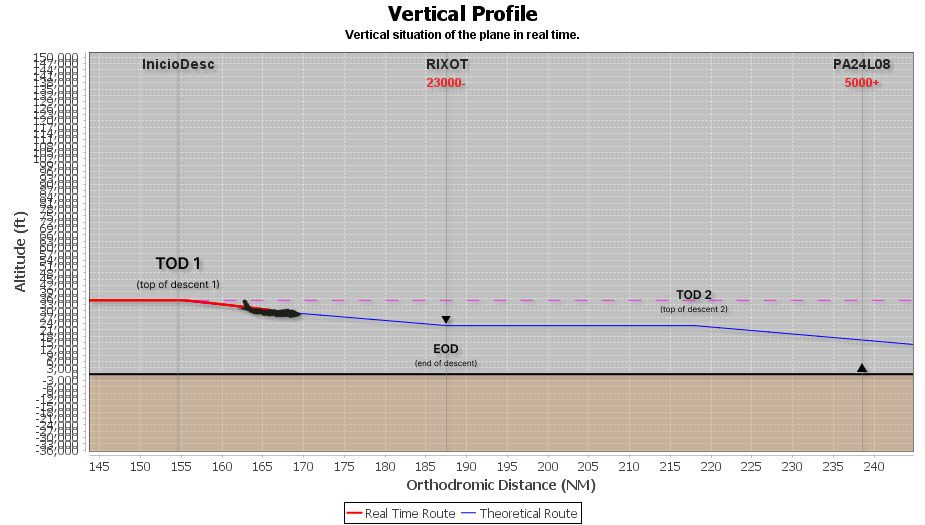

# Mejora en la Automatización del Perfil Vertical de un Simulador de Vuelo

El presente trabajo, fué mi Proyecto Final de Grado realizado en la Universidad Politécnica de Valencia. Un trabajo basado en el lenguaje de programación Java, que busca la mejora de una herramienta de simulación de un controlador de tráfico aéreo ya existente.

El objetivo del proyecto se centraba en mejorar las dinámicas de vuelo del avión y mostrar por pantalla la situación en tiempo real de este, así como crear varias funcionalidades para modificar y visualizar mejor las trazas del vuelo.

Si quieres saber más sobre el proyecto, adjunto la memoria en pdf.

### Imágenes del resultado final

# Tecnologías utilizadas
 

## Mi nombre es Carlos López 👋🏾
### Software Developer

Me dedico al desarrollo software y en GitHub comparto todos los proyectos que he realizado hasta el momento. Mi objetivo es compartir con la comunidad mi progreso como programador y también mi conocimiento, por si pudiera ser de ayuda.

### Accede a mi perfil para más información
